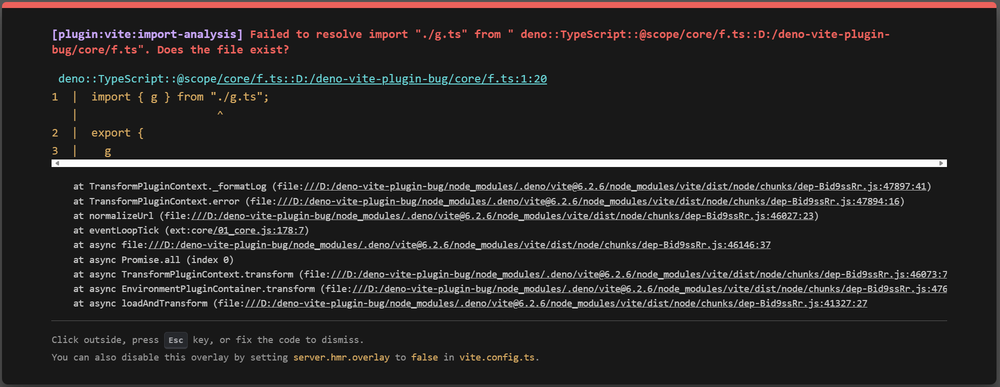

# `@deno/vite-plugin` Bug

This is a reproduction a bug related to relative imports in workspace members.



```sh
cd app
deno task dev
```

Deno version: 2.2.8

Platform:

- Windows 11 arm-64: **Failed**
- [Codesandbox Devbox][1]: OK

[1]: https://codesandbox.io/p/devbox/gclkqs?file=%2Fapp%2Fsrc%2Fmy-element.ts%3A1%2C1
